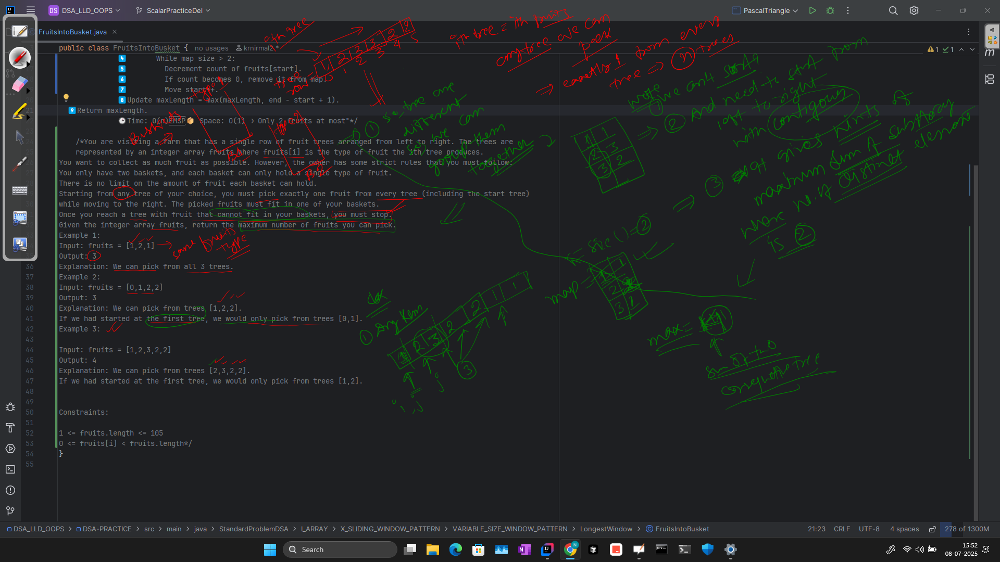

Great question! Here’s a **handpicked list of the best tips, tricks, and patterns** to master the **Two Pointer technique** — especially the **non-sliding window** ones (which often confuse people).

---

## 🚀 TWO POINTERS – TIPS & TRICKS TO MASTER

---

### 🔁 1. **Use when the array is sorted**
Two pointers shine when the input is **sorted** (ascending/descending). You can often:
- Move from both ends to **narrow the search**
- Avoid nested loops using pointer logic

🔍 Example: `Two Sum II`, `Container With Most Water`, `Sorted Squares`

---

### 🔄 2. **Start with one fixed pointer, and adjust the other**
This is your weapon for problems like:
- Finding pairs/triplets/quads with conditions (e.g., sum = target)
- Fixed + 2-pointer combo

🎯 Trick: Fix `i` with a loop, and apply 2-pointers from `i+1` to `n-1`

🔍 Example: `3Sum`, `4Sum`, `3Sum Closest`

---

### 🐢🏃 3. **Slow-Fast pointer pattern**
Use when:
- You need to **remove duplicates**
- Or move elements in place
- Or detect patterns in traversal (e.g., cycle detection)

👣 `slow` moves only when a condition is satisfied, `fast` explores

🔍 Example: `Remove Duplicates`, `Move Zeroes`, `Floyd’s Cycle Detection`

---

### 💧 4. **Two pointers on different arrays**
You can use **one pointer per array** when:
- Finding smallest difference between two arrays
- Merging sorted arrays

⚡ Trick: Traverse both arrays together in sorted fashion

🔍 Example: `Merge Sorted Array`, `Smallest Difference`, `Find K Closest Elements`

---

### 🧠 5. **When to move `left` vs `right` pointer?**
Always base it on **the condition** you're trying to meet.

👉 For `min/max` area (e.g., `Container With Most Water`):
- Move the **shorter bar inward** because only that can help increase area.

👉 For `arr[i] == i` type logic:
- Use `Binary Search` + pointer insight: check `arr[mid] < mid`, then search `right`.

---

### ⚖️ 6. **Compare value vs index**
Some problems like `arr[i] == i`, `first missing positive`, `cyclic sort` require matching index and value.

💡 Tip: Treat **index as key** and compare with value. Use Binary or custom pointer approach.

🔍 Example: `Array Index & Element Equality`

---

### 📏 7. **Watch edge cases** (most forgotten pointer mistakes)
- `left <= right` vs `left < right`
- Avoid going out of bounds (`i+1`, `j-1`)
- Remember to update result **before moving pointers**

---

### 📦 8. **In-place means Two Pointers or Constant Space**
When constraints ask: “Use constant space” or “In-place”, think **two pointers** immediately.

🔍 Examples:
- `Reverse String`
- `Remove Duplicates`
- `Sort Colors`

---

### 🧩 9. **Two pointers ≠ Sliding Window always**
Sliding Window is a **sub-type** of two pointer technique.
But classic 2-pointer doesn't need to maintain a “window”. It’s more about:
- Comparison logic
- Opposite end traversal
- Dual array movement

---

### 🔄 10. **Binary Search + Two Pointers hybrid**
Some advanced problems need **binary search on index** while applying **2-pointer condition inside**.

🎯 Trick: Use BS to locate a range or point, then two pointers to extract elements from around it.

🔍 Example: `Find K Closest Elements`

---

## ✅ TL;DR Quick Patterns

| Pattern | When To Use |
|--------|-------------|
| Opposite-end | Sorted data, max/min area, comparisons |
| Slow-fast | Modifying or removing elements in-place |
| Fixed + Two Pointers | Subsets/triplets/quadruplets |
| Two arrays | Merge/compare across arrays |
| Binary + Pointers | Find target range or value |

---

Let me know if you want:
- 💻 Code templates
- 📉 Visual pointer movement diagrams
- 📋 Dry runs

And I can walk you through examples step-by-step. Ready to dive deeper into any level?