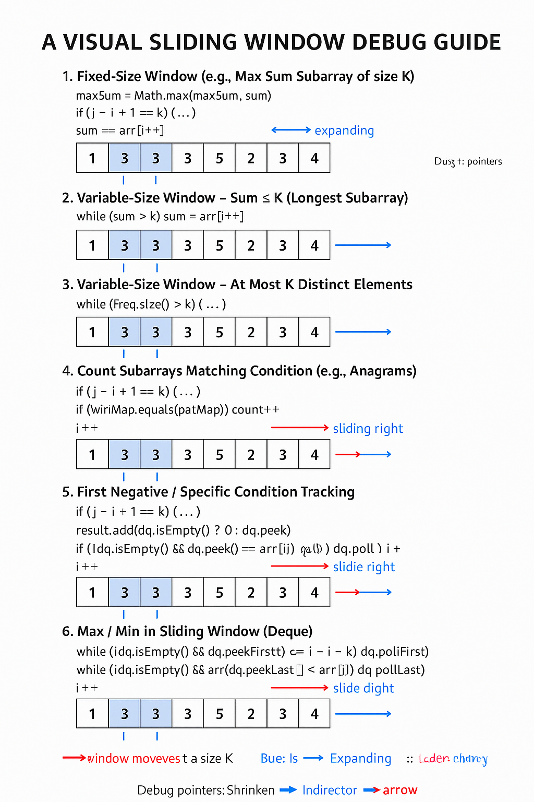

Here’s the **Sliding Window Mistakes & Debugging Guide** — it covers **common pitfalls, symptoms, and fixes** you’ll
encounter in coding interviews:

---


# ⚡ Sliding Window Mistakes & Debugging Guide

### **1. Wrong Shrinking Condition**

* **Mistake:**
  `while (sum > 0)` instead of `while (sum > k)`.
* **Symptom:**
  Window shrinks even when sum == k, losing valid subarrays.
* **Fix:**
  Always shrink while `sum > k` (for positive integers).

---

### **2. Incorrect Window Size Calculation**

* **Mistake:**
  Using `end - start` instead of `end - start + 1`.
* **Symptom:**
  Off-by-one errors; wrong window length.
* **Fix:**
  Remember: **window size = (end - start + 1)**.

---

### **3. Not Handling Negative Numbers**

* **Mistake:**
  Using sliding window when the array has negative numbers.
* **Symptom:**
  Fails for arrays with negatives because sum doesn’t always grow.
* **Fix:**
  Use **prefix sum + HashMap** instead of sliding window.

---

### **4. Forgetting to Update Max/Min Before Shrinking**

* **Mistake:**
  Update maxWindow **after** shrinking window.
* **Symptom:**
  Misses valid maximum-length windows.
* **Fix:**
  Always update maxWindow **immediately after sum == k** and before any shrinking.

---

### **5. Not Resetting Sum When Window Fully Shrinks**

* **Mistake:**
  Leaving extra elements in sum after window slides past `start`.
* **Symptom:**
  Sum grows incorrectly and includes old elements.
* **Fix:**
  Every time you shrink: `sum -= arr[start++]`.

---

### **6. Wrong Index Tracking for Result**

* **Mistake:**
  Returning `[start, end]` directly without saving best window indices.
* **Symptom:**
  Returns the last valid window, not the largest one.
* **Fix:**
  Keep `maxStart`, `maxEnd` separately; update only when new max length found.

---

### **7. Confusing Window Expansion vs. Shrinking**

* **Mistake:**
  Moving `end++` in both branches blindly.
* **Symptom:**
  Infinite loops or skipping elements.
* **Fix:**

    * Expand (`end++`) **when adding elements**.
    * Shrink (`start++`) **when sum > k or constraint violated**.

---

### **8. Forgetting Edge Cases**

* **Edge Cases to Check:**

    * `k` > array length → return empty.
    * `k` == 0 → handle separately.
    * Empty array → return empty.

---

### **9. Misusing Data Structures**

* **Mistake:**
  Using `HashMap.size()` for unique count but not removing keys when frequency == 0.
* **Symptom:**
  Wrong count of unique elements in window.
* **Fix:**
  Always `remove(key)` if `freq == 0`.

---

### **10. Debugging Tip**

* **Print debugging variables**:

  ```java
  System.out.println("Start=" + start + ", End=" + end + ", Sum=" + sum);
  ```

  Watch how `sum`, `start`, and `end` evolve per iteration.

---
Here’s your **Sliding Window Debugging Checklist** — keep it handy while fixing your code.

---

# **Sliding Window Debugging Checklist** (1‑Minute)

1. **Did I initialize `start`, `end`, `sum`, and result variables correctly?**
2. **Am I expanding the window (`end++`) only when adding elements?**
3. **Am I shrinking (`start++`) only when a constraint (e.g., `sum > k` or `zeroCount > 1`) is violated?**
4. **Did I update `sum` correctly while expanding AND shrinking?**
5. **Am I checking the right condition for shrinking?** (`while sum > k` not `while sum > 0`)
6. **Is the window size formula correct?** (`end - start + 1`)
7. **Am I updating my result (max/min) at the right time (before shrinking)?**
8. **Am I storing the correct indices (`maxStart`, `maxEnd`) for the best window?**
9. **Have I handled edge cases?** (empty array, `k` > n, `k == 0`, negatives)
10. **Did I print `start`, `end`, `sum` to watch how they move if I’m stuck?**

---
Here’s your **Sliding Window Templates Cheat Sheet** — covers \~90% of interview problems.

---

# **Sliding Window Templates Cheat Sheet**

### **1. Fixed-Size Window (e.g., Max Sum Subarray of size K)**

```java
int i = 0, sum = 0, maxSum = Integer.MIN_VALUE;
for (int j = 0; j < n; j++) {
    sum += arr[j];
    if (j - i + 1 == k) {       // window hits size k
        maxSum = Math.max(maxSum, sum);
        sum -= arr[i++];        // slide window
    }
}
```

---

### **2. Variable-Size Window – Sum ≤ K (Longest Subarray)**

```java
int i = 0, sum = 0, maxLen = 0;
for (int j = 0; j < n; j++) {
    sum += arr[j];
    while (sum > k) sum -= arr[i++];  // shrink if condition breaks
    maxLen = Math.max(maxLen, j - i + 1);
}
```

---

### **3. Variable-Size Window – At Most K Distinct Elements**

```java
Map<Integer, Integer> freq = new HashMap<>();
int i = 0, maxLen = 0;
for (int j = 0; j < n; j++) {
    freq.put(arr[j], freq.getOrDefault(arr[j], 0) + 1);
    while (freq.size() > k) {
        freq.put(arr[i], freq.get(arr[i]) - 1);
        if (freq.get(arr[i]) == 0) freq.remove(arr[i]);
        i++;
    }
    maxLen = Math.max(maxLen, j - i + 1);
}
```

---

### **4. Count Subarrays Matching Condition (e.g., Anagrams)**

```java
Map<Character, Integer> patMap = new HashMap<>();
// fill patMap with pattern chars
Map<Character, Integer> winMap = new HashMap<>();
int i = 0, count = 0;

for (int j = 0; j < text.length(); j++) {
    winMap.put(text.charAt(j), winMap.getOrDefault(text.charAt(j), 0) + 1);
    if (j - i + 1 == k) {
        if (winMap.equals(patMap)) count++;
        winMap.put(text.charAt(i), winMap.get(text.charAt(i)) - 1);
        if (winMap.get(text.charAt(i)) == 0) winMap.remove(text.charAt(i));
        i++;
    }
}
```

---

### **5. First Negative / Specific Condition Tracking**

```java
Deque<Integer> dq = new LinkedList<>();
List<Integer> result = new ArrayList<>();
int i = 0;

for (int j = 0; j < n; j++) {
    if (arr[j] < 0) dq.add(arr[j]);
    if (j - i + 1 == k) {
        result.add(dq.isEmpty() ? 0 : dq.peek());
        if (!dq.isEmpty() && dq.peek() == arr[i]) dq.poll();
        i++;
    }
}
```

---

### **6. Max/Min in Sliding Window (Deque)**

```java
Deque<Integer> dq = new LinkedList<>();
int[] res = new int[n - k + 1];

for (int i = 0; i < n; i++) {
    while (!dq.isEmpty() && dq.peekFirst() <= i - k) dq.pollFirst();
    while (!dq.isEmpty() && arr[dq.peekLast()] < arr[i]) dq.pollLast();
    dq.offerLast(i);
    if (i >= k - 1) res[i - k + 1] = arr[dq.peekFirst()];
}
```

---

Would you like me to make **a “Visual Sliding Window Debug Guide”** (diagram showing `i`, `j`, and window movement for
all 6 templates)?
I can give it in **1 image** — should I proceed?


---

## 🟢 Basic Level (Fixed-size Window)

1. **Maximum Sum Subarray of Size K**  
   _Find max sum of any contiguous subarray of size `k`_  
   🔗 [Leetcode 643](https://leetcode.com/problems/maximum-average-subarray-i/)

2. **Maximum Product Subarray of Size K**  
   _Handle zeros and negatives carefully_  
   ✅ Practice with dry run (you just did this!)

3. **Count Occurrences of Anagrams**  
   _Count how many substrings are anagrams of a given pattern_  
   🔗 [GeeksforGeeks Link](https://www.geeksforgeeks.org/count-occurrences-of-anagrams/)

4. **Number of Substrings Containing Exactly K Distinct Characters**  
   🔗 [Leetcode 992](https://leetcode.com/problems/subarrays-with-k-different-integers/)

---

## 🟡 Intermediate Level (Variable-size Window)

5. **Longest Substring Without Repeating Characters**  
   🔗 [Leetcode 3](https://leetcode.com/problems/longest-substring-without-repeating-characters/)

6. **Minimum Size Subarray Sum ≥ Target**  
   🔗 [Leetcode 209](https://leetcode.com/problems/minimum-size-subarray-sum/)

7. **Longest Substring with At Most K Distinct Characters**  
   🔗 [Leetcode 340](https://leetcode.com/problems/longest-substring-with-at-most-k-distinct-characters/)

8. **Longest Repeating Character Replacement**  
   🔗 [Leetcode 424](https://leetcode.com/problems/longest-repeating-character-replacement/)

9. **Permutation in String**  
   🔗 [Leetcode 567](https://leetcode.com/problems/permutation-in-string/)

---

## 🔴 Advanced Level (Optimization + Tricky Conditions)

10. **Sliding Window Maximum**  
    _Use deque for O(n)_  
    🔗 [Leetcode 239](https://leetcode.com/problems/sliding-window-maximum/)

11. **Substring with Concatenation of All Words**  
    _Match substrings in any order_  
    🔗 [Leetcode 30](https://leetcode.com/problems/substring-with-concatenation-of-all-words/)

12. **Minimum Window Substring**  
    _Classic problem: smallest window containing all chars of another string_  
    🔗 [Leetcode 76](https://leetcode.com/problems/minimum-window-substring/)

13. **Count Number of Nice Subarrays**  
    _Count subarrays with exactly K odd numbers_  
    🔗 [Leetcode 1248](https://leetcode.com/problems/count-number-of-nice-subarrays/)

14. **Fruit Into Baskets** (Max subarray with at most 2 distinct numbers)  
    🔗 [Leetcode 904](https://leetcode.com/problems/fruit-into-baskets/)

15. **Max Consecutive Ones III** (Flip at most K zeros)  
    🔗 [Leetcode 1004](https://leetcode.com/problems/max-consecutive-ones-iii/)

---

### ✅ Suggested Practice Order:
- Start with **1 to 4** to master the fixed window template.
- Then move on to **5 to 9** to solidify variable window logic.
- Finally tackle **10 to 15** to prepare for **real FAANG-level** challenges.

    
    
    Variable Sliding Window
    ├── 1. Longest / Maximum Length Problems
    │   ├── Longest Substring Without Repeating Characters
    │   ├── Longest Substring With At Most K Distinct Characters
    │   ├── Replace K characters to get longest same-char substring
    │   ├── Fruits Into Baskets (at most 2 distinct)
    │   └── 🔁 Template:
    │       for (right in range):
    │           update window
    │           while (window invalid):
    │               shrink from left
    │           update max length
    │
    ├── 2. Count Subarrays with Constraints
    │   ├── Subarrays with Exactly K distinct elements
    │   ├── Subarrays with Exactly K odd numbers
    │   ├── Substrings with at least one a, b, c
    │   ├── 🔁 Trick: count(atMostK) - count(atMostK-1)
    │   └── 🔁 Template:
    │       int countAtMostK(int K)
    │
    ├── 3. Min/Max Length with Sum Constraints
    │   ├── Min length subarray with sum ≥ K
    │   ├── Max subarray sum ≤ K
    │   └── 🔁 Template:
    │       expand right to include nums[right]
    │       while (sum > K): shrink from left
    │       update minLength if valid
    │
    ├── 4. Binary Array Specials
    │   ├── Max consecutive 1s after flipping at most 1 zero
    │   ├── Maximize 0s by flipping one subarray (Kadane's trick)
    │   └── 🔁 Binary count and sum flipping
    │
    ├── 5. Edge Selection / Dual-End
    │   ├── cardPoints: pick k cards from ends
    │   └── 🔁 Trick:
    │       maxSum = total - minSum(subarray of size n-k)
    │
    ├── 6. Minimum Window Problems
    │   ├── Minimum Window Substring (all of t in s)
    │   └── 🔁 Two hash maps: needCount vs. windowCount
    │       while (valid): shrink from left
    │
    ├── 7. Partitioning
    │   ├── Partition array into k subarrays with equal sum
    │   └── Often solved with backtracking, not window
