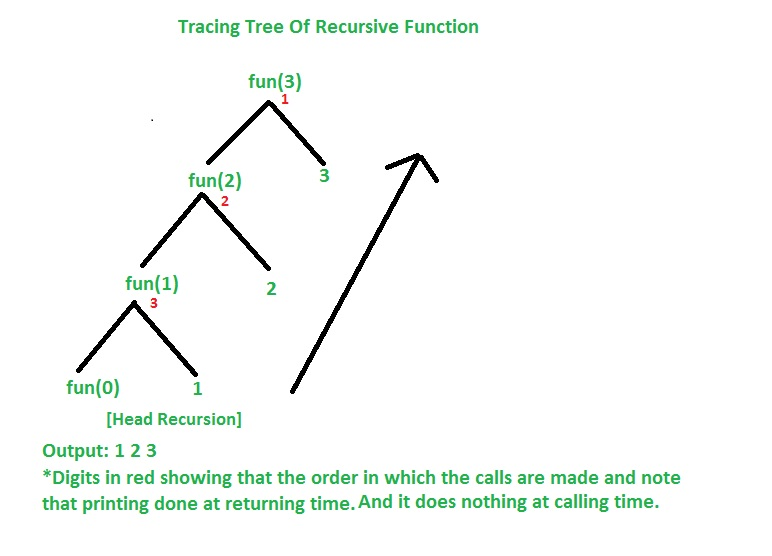
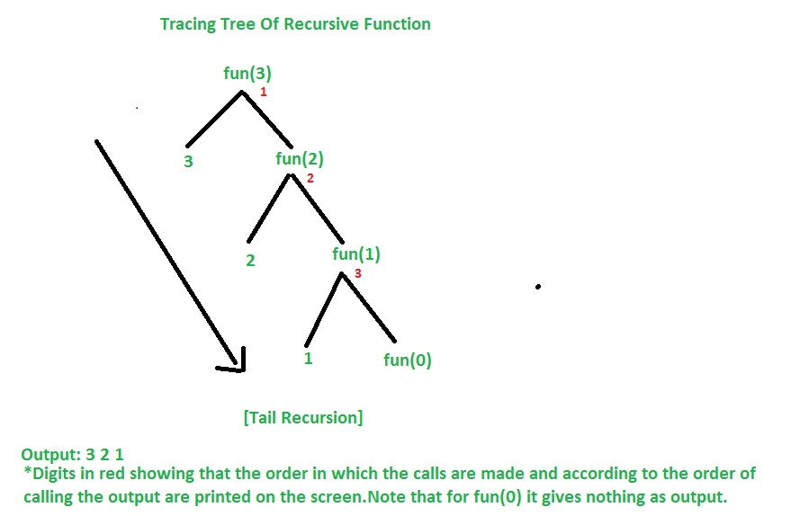
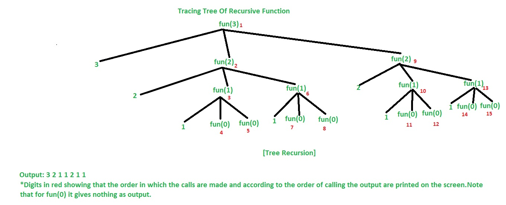
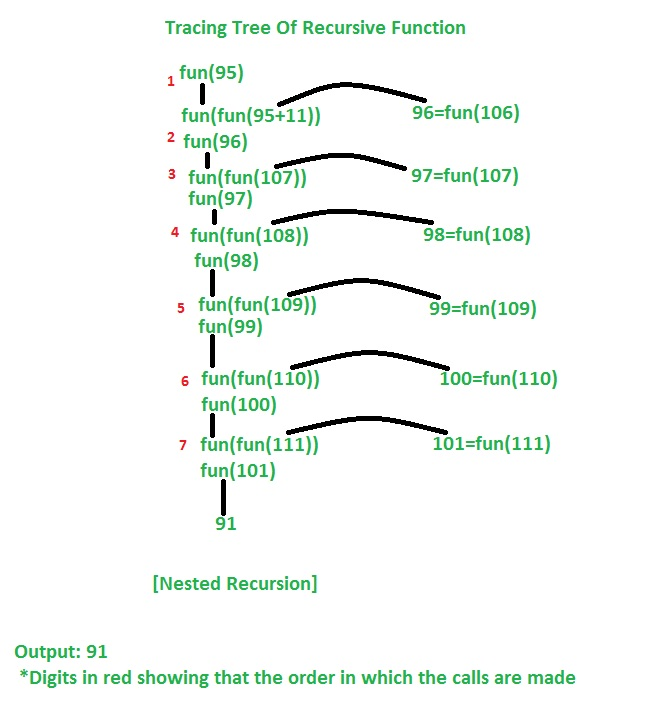
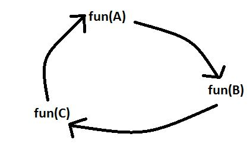

## 1. Recursion: Concept Overview

* **Definition**: A recursive function is one that calls itself directly or indirectly to solve smaller instances of the same problem ([GeeksforGeeks][1]).
* **Why use recursion?**

    * Simplifies complex tasks by breaking them into manageable subproblems ([GeeksforGeeks][1]).
    * Naturally fits **divide and conquer** strategies: e.g., merge sort, quicksort ([GeeksforGeeks][1]).
    * Ideal for **backtracking** (e.g., N-Queens, Sudoku) ([GeeksforGeeks][1]).
    * Great for navigating **tree or graph structures** ([GeeksforGeeks][1]).
* **Core components**:

    1. **Base case** – defines when to stop recursion.
    2. **Recursive case** – breaks the problem into smaller subproblems and recurses ([GeeksforGeeks][2]).

---

## 2. Types of Recursion

### A. By Call Pattern (Function Involvement)

1. **Direct Recursion**: A function calls itself within its own body ([GeeksforGeeks][3]).
2. **Indirect Recursion**: Function A calls B, which eventually calls A ([GeeksforGeeks][3]).

    * **Mutual Recursion**: A special case of indirect recursion involving two or more functions calling each other ([Wikipedia][4], [Number Analytics][5]).

### B. By Call Position (Within Function Body)

Based on direct recursion structure, we have:

* **Head Recursion**: Call happens before any other operations; processing after returning ([GeeksforGeeks][6]).
* **Tail Recursion**: Recursive call is the final action—ideal for optimization ([GeeksforGeeks][3], [Wikipedia][7]).
* **Non-Tail (or General) Recursion**: Work remains after the recursive call, which prevents tail-call optimization ([Simplilearn.com][8], [GeeksforGeeks][9]).
* **Tree (Multiple) Recursion**: Function makes more than one recursive call per invocation—for example, Fibonacci or exhaustive search trees ([GeeksforGeeks][6]).
* **Nested Recursion**: Recursive call’s parameter itself involves another recursive call (e.g., `nested(nested(n+11))`) ([GeeksforGeeks][6]).
* **Indirect recursion**: there may be more than one functions and they are calling one another in a circular manner.

### C. Other Classifications (Conceptual/Theoretical)

* **Single vs Multiple Recursion**:

    * *Single* = one recursive call per function call (e.g., factorial, linear tree traversal).
    * *Multiple* = several recursive calls (e.g., naive Fibonacci) ([Wikipedia][10]).
* **Anonymous Recursion**: Recursion via unnamed (anonymous) functions ([Wikipedia][10]).
* **Structural vs Generative Recursion**:

    * *Structural*: Recursion follows the inherent structure of data (like tree nodes or linked list) ([Wikipedia][10]).
    * *Generative*: Not strictly based on data structure; problem generates new inputs for recursion.

---

## 3. Recursion & Performance Insights

* **Stack Use**: Each call consumes stack space; without proper base cases, you risk stack overflow ([GeeksforGeeks][2]).
* **Tail Recursion Optimization**:

    * In many languages (especially functional ones), tail calls can be optimized to reuse stack frames, saving memory ([Wikipedia][7]).

---

## 4. Practical Tips for DSA Problem Solving

| Step | Action                                                                                                     |
| ---- | ---------------------------------------------------------------------------------------------------------- |
| 1⃣   | **Understand the problem**—can it be broken down recursively?                                              |
| 2⃣   | **Identify the base case(s)**—clear stopping condition(s).                                                 |
| 3⃣   | **Define the recursive case**—ensure the problem size decreases.                                           |
| 4⃣   | **Consider recursion type**—optimize with tail recursion if possible.                                      |
| 5⃣   | **Analyze complexity**—watch for exponential blow-up (e.g., Fibonacci), use memoization or DP when needed. |
| 6⃣   | **Test edge cases**—empty inputs, maximum depth, null or boundary values.                                  |
| 7⃣   | **Convert to iterative (if needed)**—if recursion depth is too deep or optimization is critical.           |

---

### Summary Note (Quick Glance)

* **Recursion**: A method where functions solve problems by calling themselves on smaller inputs.

    * **Structured in two parts**: base case + recursive case.
* **Kinds of recursion**:

    * *Direct* / *Indirect* (including mutual recursion).
    * *Head*, *Tail*, *Non-tail*, *Tree*, *Nested*.
    * *Single* vs *Multiple*, *Anonymous*, *Structural vs Generative*.
* **Efficiency**:

    * Stack safety, tail-call optimization, memoization for overlapping subproblems.
* **Gentle tips**: Always ensure termination, avoid over-recursion, and consider iterative alternatives when performance matters.

---

Let me know if you'd like this turned into a visual mind-map or shorthand flashcards—happy to help you prep!

[1]: https://www.geeksforgeeks.org/dsa/recursive-functions/?utm_source=chatgpt.com "Recursive Functions - GeeksforGeeks"
[2]: https://www.geeksforgeeks.org/introduction-to-recursion-2/?utm_source=chatgpt.com "Introduction to Recursion - GeeksforGeeks"
[3]: https://www.geeksforgeeks.org/dsa/types-of-recursions/?utm_source=chatgpt.com "Types of Recursions - GeeksforGeeks"
[4]: https://en.wikipedia.org/wiki/Mutual_recursion?utm_source=chatgpt.com "Mutual recursion"
[5]: https://www.numberanalytics.com/blog/mastering-recursion-data-structures?utm_source=chatgpt.com "Mastering Recursion in Data Structures - Number Analytics"
[6]: https://www.geeksforgeeks.org/c/types-of-recursion-in-c/?utm_source=chatgpt.com "Types of Recursion in C - GeeksforGeeks"
[7]: https://en.wikipedia.org/wiki/Tail_call?utm_source=chatgpt.com "Tail call"
[8]: https://www.simplilearn.com/tutorials/data-structure-tutorial/recursive-algorithm?utm_source=chatgpt.com "What is Recursive Algorithm? Types and Methods | Simplilearn"
[9]: https://www.geeksforgeeks.org/python/recursion-in-python/?utm_source=chatgpt.com "Recursion in Python - GeeksforGeeks"
[10]: https://en.wikipedia.org/wiki/Recursion_%28computer_science%29?utm_source=chatgpt.com "Recursion (computer science)"

            Recursion
                │
                ├── By Call Pattern
                │   │
                │   ├── Direct Recursion
                │   │     └── Function calls itself directly
                │   │         Example: factorial(n) → factorial(n-1)
                │   │
                │   └── Indirect Recursion
                │         ├── Function A → Function B → Function A
                │         └── Mutual Recursion
                │               └── Special case of indirect recursion (two or more functions call each other)
                │
                ├── By Position of Call in Function
                │   │
                │   ├── Head Recursion
                │   │     └── Recursive call happens before other operations
                │   │         Example:
                │   │           func(n):
                │   │             if n == 0: return
                │   │             func(n-1)
                │   │             print(n)  ← executes after recursion
                │   │
                │   ├── Tail Recursion
                │   │     └── Recursive call is the last operation (can be optimized)
                │   │         Example:
                │   │           func(n, acc):
                │   │             if n == 0: return acc
                │   │             return func(n-1, acc + n)
                │   │
                │   ├── Non-Tail (General) Recursion
                │   │     └── Work is done after recursive call (prevents tail optimization)
                │   │         Example:
                │   │           return 1 + func(n-1)
                │   │
                │   ├── Tree (Multiple) Recursion
                │   │     └── More than one recursive call per function call
                │   │         Example:
                │   │           fib(n):
                │   │             if n <= 1: return n
                │   │             return fib(n-1) + fib(n-2)
                │   │
                │   └── Nested Recursion
                │         └── Recursive call’s argument is itself a recursive call
                │             Example:
                │               f(n):
                │                 if n > 100: return n - 10
                │                 return f(f(n + 11))
                │
                ├── By Number of Recursive Calls
                │   │
                │   ├── Single Recursion
                │   │     └── Only one recursive call per function execution
                │   │         Example: factorial
                │   │
                │   └── Multiple Recursion
                │         └── Multiple recursive calls per function execution
                │             Example: Fibonacci
                │
                ├── By Function Style
                │   │
                │   ├── Anonymous Recursion
                │   │     └── Recursion via anonymous (lambda) function
                │   │
                │   ├── Structural Recursion
                │   │     └── Recursion follows structure of input data
                │   │         Example: traversing linked list, binary tree
                │   │
                │   └── Generative Recursion
                │         └── Generates new subproblems not strictly tied to data structure
                │             Example: QuickSort partitioning
                │
                └── Optimization Considerations
                │
                ├── Tail-Call Optimization (TCO)
                ├── Memoization for overlapping subproblems
                └── Iterative conversion if recursion depth too high
