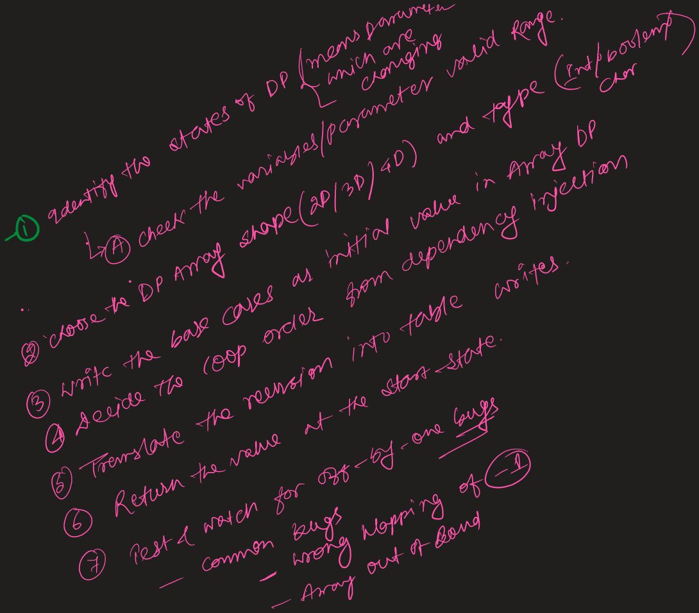

# General steps to convert recursion → tabulation (portable checklist)


here example taken is LIS

1. **Identify the DP state (parameters).**
   e.g. `helper(index, prevIndex)` → state = `(index, prevIndex)`.

2. **Determine each state's valid range.**
   Convert any sentinel values (like `prevIndex = -1`) into a non-negative index by shifting (e.g. store `prevIndex+1`).

3. **Choose DP array shape & types.**
   Allocate array sizes based on ranges. Add `+1` rows/cols where base-case needs `index == n` or `prev == -1` mapped to
   `0..n`.

4. **Write the base case(s) as initial table values.**
   If recursion returns `0` at `index == n`, initialize `dp[n][*] = 0` (default for integer arrays in Java is 0 —
   useful).

5. **Decide loop order from dependency direction.**
   If `dp[index]` depends on `dp[index+1]`, iterate `index` from `n-1` down to `0`. For each `index`, loop `prev` across
   its allowed range (often `index-1` down to `-1`), mapping to array indices.

6. **Translate the recurrence into table writes.**
   Replace recursive calls with table lookups (using the mapped indices).

7. **Return the value at the start-state.**
   Usually `dp[0][mappedPrev]` (for your LIS, `dp[0][0]` if `prev=-1` mapped to `0`).

8. **(Optional) Add parent pointers to reconstruct solution.**
   Keep a separate `choice` or `parent` table storing whether you took or skipped an element.

9. **(Optional) Optimize space/time.**
   If `dp[index]` depends only on `dp[index+1]`, use two rows or 1D rolling array. Also consider better algorithms (
   e.g., patience O(n log n) for LIS).

10. **Test & watch for off-by-one bugs.**
    Common bugs: wrong mapping of `-1`, iterating `prev` in wrong direction, array-index OOB.

---

# Apply to your `lengthOfLIS` — bottom-up tabulation (Java)

This directly mirrors your memoization mapping `dp[index][prevIndex+1]`.

```java
import java.util.Arrays;

class Solution {
    public int lengthOfLIS(int[] nums) {
        int n = nums.length;
        // dp[index][prevIndex+1] -> ranges: index 0..n, prevIndex+1 0..n
        int[][] dp = new int[n + 1][n + 1]; // initialized to 0 by default

        // base: dp[n][*] = 0 already

        // fill bottom-up: index from n-1 down to 0
        for (int index = n - 1; index >= 0; --index) {
            // prev ranges from index-1 down to -1; map prev+1 => 0..index
            for (int prev = index - 1; prev >= -1; --prev) {
                int notTake = dp[index + 1][prev + 1];
                int take = 0;
                if (prev == -1 || nums[index] > nums[prev]) {
                    // when we take current, next state is (index+1, index)
                    take = 1 + dp[index + 1][index + 1];
                }
                dp[index][prev + 1] = Math.max(take, notTake);
            }
        }

        // start state: index=0, prevIndex=-1 => prevIndex+1 = 0
        return dp[0][0];
    }
}
```

Time: `O(n^2)`. Space: `O(n^2)`.

---

# Space-optimized tabulation (only two rows)

Because `dp[index][*]` needs only `dp[index+1][*]`, you can keep 2 rows (current and next):

```java
class Solution {
    public int lengthOfLIS(int[] nums) {
        int n = nums.length;
        int[] next = new int[n + 1]; // dp[index+1][*]
        int[] curr = new int[n + 1]; // dp[index][*]

        for (int index = n - 1; index >= 0; --index) {
            Arrays.fill(curr, 0);
            for (int prev = index - 1; prev >= -1; --prev) {
                int notTake = next[prev + 1];
                int take = 0;
                if (prev == -1 || nums[index] > nums[prev]) {
                    take = 1 + next[index + 1];
                }
                curr[prev + 1] = Math.max(take, notTake);
            }
            // move up
            int[] tmp = next;
            next = curr;
            curr = tmp;
        }
        return next[0]; // after loop, next corresponds to dp[0][*]
    }
}
```

Space: `O(n)` for each row => overall `O(n)`.

---

# Reconstructing the LIS (short note)

* Keep a `choice[index][prev+1]` boolean (or parent pointer) while filling table: `true` if taking yields the max,
  otherwise `false`.
* After table is filled, start at `(0, -1)` and follow choices to build the sequence.

---

# Common pitfalls / checklist when converting

* Forgetting to **shift** sentinel `-1` to `+1` index in arrays.
* Wrong loop direction: if state uses `index+1`, `index` must go descending.
* Off-by-one when using `index+1` or `prev+1`.
* Not initializing base cases (if default 0 is not correct).
* Accidentally restricting `prev` range too much — ensure you cover all mapped indices stored in memo version.

---
Short answer: **Yes — the loop order matters** whenever a table cell depends on other cells that must already be
computed. You **must** iterate in a topological order of the DP-state dependency graph. If you iterate in the wrong
direction you’ll read uninitialized / still-default values and get incorrect results.

Below is a concise explanation + rules + concrete examples you can apply to any DP.

---

# Why order matters (intuitive)

Recursion naturally defines dependencies: `f(index)` calls `f(index+1)` → `f(index)` depends on `f(index+1)`. In
tabulation you must compute every state *after* all the states it depends on are computed. That means you must visit
states in an order such that when you write `dp[s]` you can look up all `dp[dependentStates]` which are already filled.

Think in terms of a directed acyclic graph (DAG) where an edge `A → B` means `A` depends on `B`. Tabulation requires a
topological ordering of that DAG.

---

# Rules of thumb

1. **If recursion goes forward (calls `index+1`, `index+2`, …)**
   Iterate `index` from large → small (descending). Example: your LIS recursion `helper(index, ...)` calls
   `helper(index+1, ...)` so `index` must go `n-1` down to `0`.

2. **If recursion goes backward (calls `index-1`, …)**
   Iterate `index` from small → large (ascending).

3. **If you use a 1D/rolling-array optimization and the recurrence uses the same array index (e.g., 0/1 knapsack)**
   Iterate the inner loop backwards to avoid overwriting values you still need. (Classic: for weights go `W..w`
   descending.)

4. **For multi-parameter state (e.g., `dp[i][j]`)**
   Determine dependency directions for both `i` and `j`. Loop outer/inner in directions that guarantee dependencies are
   computed first (a nested topological order).

5. **If dependencies are on the same row (like `dp[i][j]` depends on `dp[i][j-1]`)**
   Make sure the inner loop goes in the direction that computes `dp[i][j-1]` before `dp[i][j]`.

---

# Concrete: your LIS tabulation

Your recurrence uses `dp[index+1][*]` (next index). So `index` must run descending:

```text
for index = n-1 down to 0:
    for prev = index-1 down to -1:  // or prev+1 mapping
         use dp[index+1][...]
         write dp[index][...]
```

If you instead do `index` ascending (0 → n-1) you’ll try to read `dp[index+1][...]` before it’s been filled. Since Java
int arrays default to `0`, you’ll undercount lengths and get wrong answers.

---

# Small (mental) counterexample

Take nums = \[3,1,2]. If you fill `index = 0` first and read `dp[1][*]` which is still default `0`, the algorithm thinks
the best after index 0 is 0 (wrong). Filling from right→left computes correct `dp[2]` and `dp[1]` before using them for
`dp[0]`.

---

# When left→right *does* work

Some DP recurrences are naturally left→right:

* Prefix-sum style DP where `dp[i] = function(dp[i-1])` → compute `i` increasing.
* Patience O(n log n) LIS algorithm processes elements left→right because its invariant only depends on previously
  processed elements.

So always inspect the recursive calls: if they call higher index (index+1) tabulate in descending index; if they call
lower index tabulate ascending.

---

# Checklist to choose order quickly

1. Look at recursive calls inside the function. Which indices/states are used? `index+1`? `prev-1`?
2. For every used state, ensure that it is computed before the current state in your loops.
3. If using one-row optimization, check whether you must iterate inner loop backwards (to avoid overwriting).
4. If in doubt, draw a small dependency arrow diagram and topologically sort it.

---

If you want, I can take your memo version and purposely show a failing left→right tabulation on a small input (so you
see the wrong result), or I can produce a general helper checklist you can paste into notes. Which would help more?
