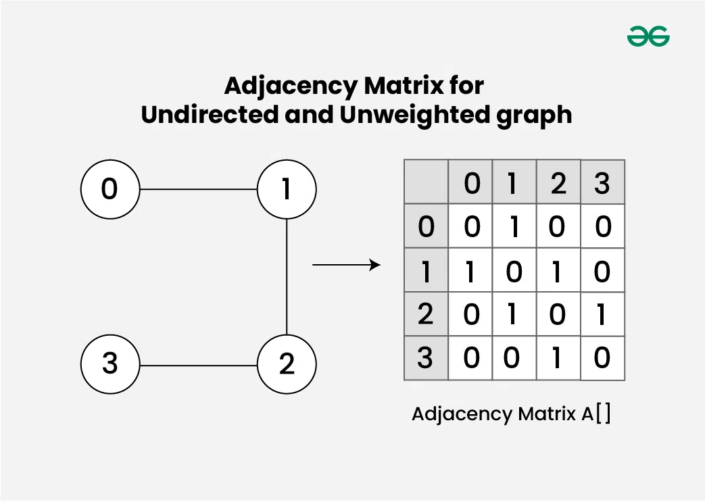
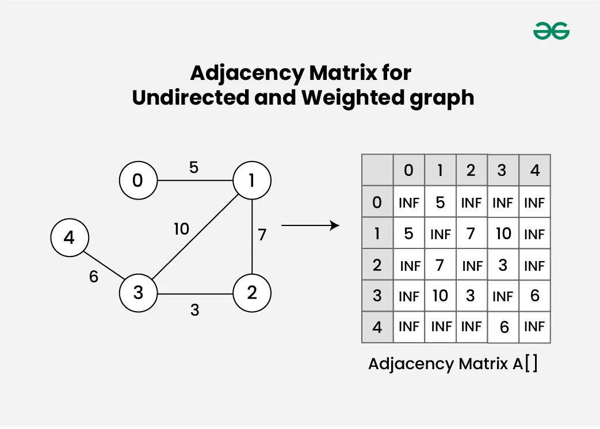
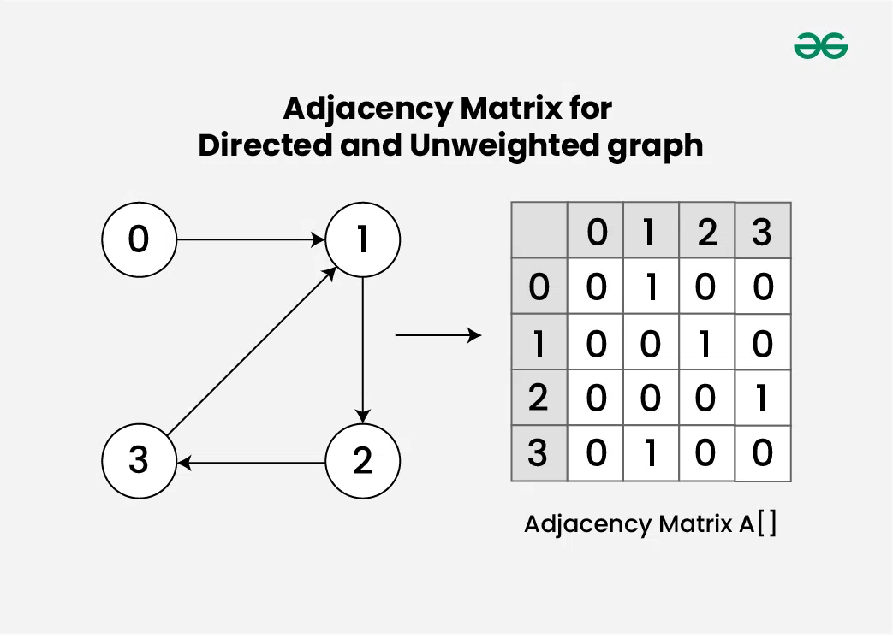
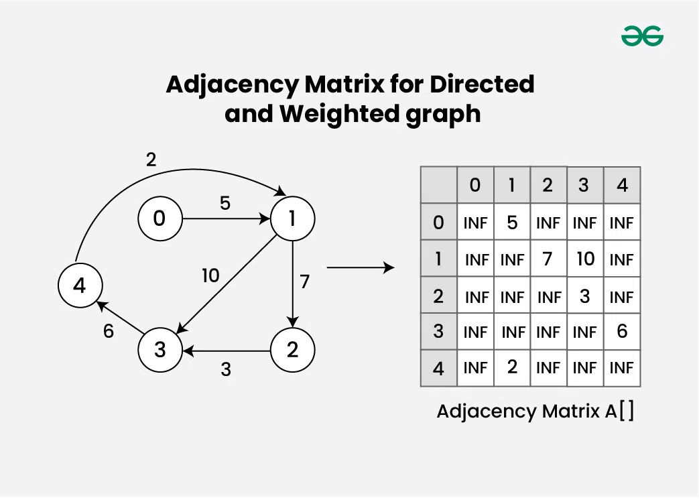

Adjacency Matrix?
> square matrix used to repersent a finite graph by sotring relationship
> between nodes and their cell
> # 1. Adjacency Matrix for Undirected and Unweighted graph:
> > >

       Consider an Undirected and Unweighted graph G with 4 vertices and 3 edges. ook like:
            
            Adjacency-Matrix-for-Undirected-and-Unweighted-graph
            
            Here's how to interpret the matrix:
            
            A[i][j] = 1, there is an edge between vertex i and vertex j.
            A[i][j] = 0, there is NO edge between vertex i and vertex j.

# 2. Adjacency Matrix for Undirected and Weighted graph:

> >
>>> > 
> Here's how to interpret the matrix:

            A[i][j] = INF, then there is no edge between vertex i and j
            A[i][j] = w, then there is an edge between vertex i and j having weight = w.

# 3. Adjacency Matrix for Directed and Unweighted graph:

       Consider an Directed and Unweighted graph G with 4 vertices and 4 edges. 
       For the graph G, the adjacency matrix would look like:
    Adjacency-Matrix-for-Directed-and-Unweighted-graph

A[i][j] ​= 1, there is an edge from vertex i to vertex j
A[i][j] ​= 0, No edge from vertex i to j.

# 4. Adjacency Matrix for Directed and Weighted graph:

       Consider an Directed and Weighted graph G with 5 vertices and 6 edges. For the graph G, the adjacency matrix would look like:
    Adjacency-Matrix-for-Directed-and-Weighted-graph
    Here's how to interpret the matrix:

A[i][j] ​= INF, then there is no edge from vertex i to j
A[i][j] ​= w, then there is an edge from vertex i having weight w

## Properties of Adjacency Matrix

Diagonal Entries: The diagonal entries A[i][j] are usually set to 0 (in case of unweighted) and INF in case of weighted,
assuming the graph has no self-loops.
Undirected Graphs: For undirected graphs, the adjacency matrix is symmetric. This means A[i][j] ​= A[j][i]​ for all i
and j.

## Applications of Adjacency Matrix:

Graph Representation: The adjacency matrix is one of the most common ways to represent a graph computationally.
Connectivity: By examining the entries of the adjacency matrix, one can determine whether the graph is connected or not.
If the graph is undirected, it is connected if and only if the corresponding adjacency matrix is irreducible (i.e.,
there is a path between every pair of vertices). In directed graphs, connectivity can be analyzed using concepts like
strongly connected components.
Degree of Vertices: The degree of a vertex in a graph is the number of edges incident to it. In an undirected graph, the
degree of a vertex can be calculated by summing the entries in the corresponding row (or column) of the adjacency
matrix. In a directed graph, the in-degree and out-degree of a vertex can be similarly determined.